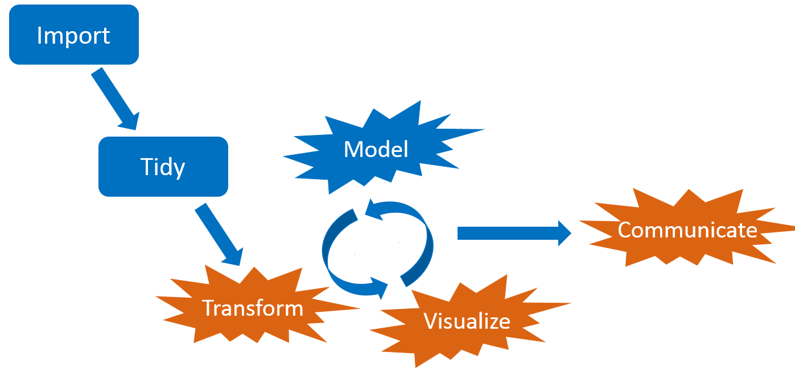
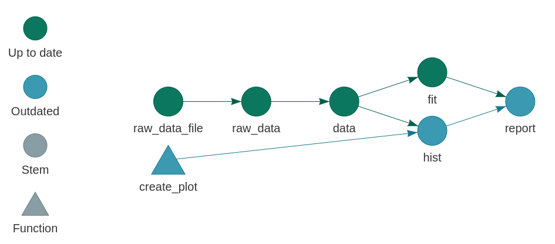
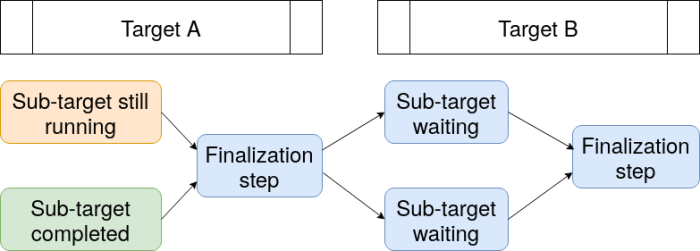
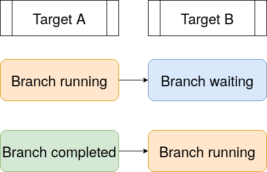
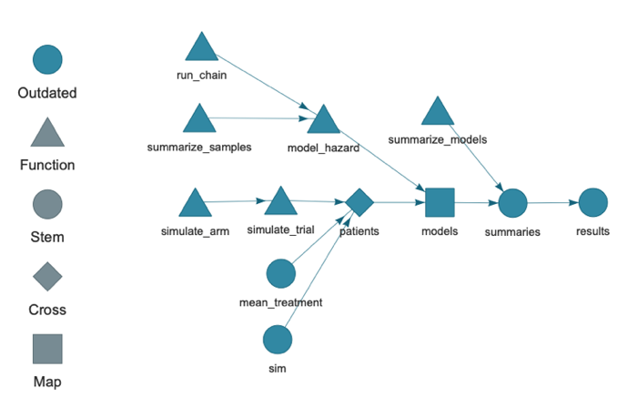
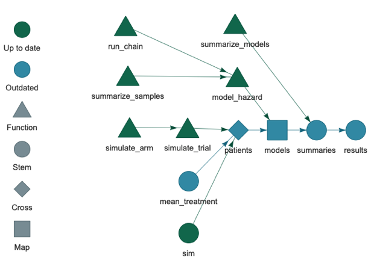

<style>
.inverse {
background-color: transparent;
text-shadow: 0 0 0px transparent;
}
.title-slide {
vertical-align: bottom !important; 
text-align: center !important;
}
.title-slide h1 {
position: absolute;
top: 0;
left: 0;
right: 0;
width: 100%;
line-height: 4em;
color: #666666;
}
.title-slide h3 {
line-height: 6em;
color: #666666;
}
.title-slide {
background-color: white;
background-image: url('images/logo.png');
background-repeat: no-repeat;
background-size: 25%;
}
.remark-slide-content:after {
content: "Copyright Eli Lilly and Company";
position: absolute;
bottom: -5px;
left: 10px;
height: 40px;
width: 100%;
font-family: Helvetica, Arial, sans-serif;
font-size: 0.7em;
color: gray;
background-repeat: no-repeat;
background-size: contain;
}
</style>

```{r, include = FALSE}
knitr::opts_chunk$set(
  eval = FALSE,
  collapse = TRUE,
  warning = FALSE,
  comment = "#>",
  fig.align = "center",
  fig.width = 10,
  fig.height = 7,
  out.width = "80%",
  out.height = "80%"
)
```

```{r, include = FALSE, message = FALSE}
options(
  warnPartialMatchArgs = FALSE,
  htmltools.dir.version = FALSE
)
```

## Large statistical computation

* [Bayesian data analysis](https://mc-stan.org/)
* [Bayesian network meta-analysis](https://bookdown.org/MathiasHarrer/Doing_Meta_Analysis_in_R/bayesian-network-meta-analysis.html)
* [Graph-based multiple comparison procedures](https://github.com/kornl/gMCP)
* [Subgroup identification](https://cran.r-project.org/web/packages/TSDT/index.html)
* [Predictive modeling](http://appliedpredictivemodeling.com/computing)
* [Deep neural networks](https://keras.rstudio.com/)
* [PK/PD modeling](https://github.com/nlmixrdevelopment/nlmixr)
* Clinical trial simulation
* Target identification

---

## Common features

1. Heavy use of the [R language](https://www.r-project.org/).
2. Long runtimes.
3. Multiple sub-tasks.
4. Frequent changes to code and data.


<br>

<!--https://openclipart.org/detail/275842/sisyphus-overcoming-silhouette-->

---

## Interconnected tasks
<center>

</center>

---

## Changes

<center>

</center>

---

## Consequences

<center>

</center>

---

## Pipeline tools and workflow managers

<center>

</center>

- Several exist already: [github.com/pditommaso/awesome-pipeline](https://github.com/pditommaso/awesome-pipeline).
- Most are language-agnostic or designed for Python or the shell.

---

## What distinguishes `targets`?

<center>

</center>

* Respects the way R works.
* Better code, i.e. functions.
* Time savings allow for an incremental development strategy:
    1. Change a couple things.
    2. Run the workflow.
    3. Inspect results.
    4. *Repeat often*.
* Better than `drake`: more powerful, more dynamic, more transparent, easier to understand, more consistent, more predictable, and more reproducible.

---

## What about `drake`?

* `drake` is still an excellent choice for pipeline management, but it has permanent user-side limitations. Solutions in `drake` itself would make the package incompatible with existing projects that use it.
* `targets` was created to overcome these limitations and create a smoother user experience and greater peace of mind:
    * A friendlier, lighter, more transparent data management system.
    * Show status of functions and other global objects.
    * Improved parallel efficiency.
    * Easier to metaprogram pipeline archetypes (e.g. `simfast` for clinical trial simulation workflows).

---

## `drake`'s cache

```
├── .drake/
├── config/
├── data/
├───── 17bfcef645301416.rds
├───── 21935c86f12692e2.rds
├───── 37caf5df2892cfc4.rds
├───── ...
├── drake/
├── keys/
├───── memoize/
├───── meta/
├───── objects/
├───── ...
└── scratch/
```

---

## The data store in `targets`

```
├── _targets/
├── meta/
├───── meta
├───── progress
├── objects/
├───── target_name_1
├───── target_name_2
├───── target_name_3
└───── ...
```

---

## Show status of functions and other global objects



---

## Dynamic branching in `drake`



---

## More efficient dynamic branching in `targets`



---

## Metaprogramming in `targets`

* `tar_target_external()` accepts language objects and avoids non-standard evaluation, which makes it easier to metaprogram pipelines for packages like `simfast`.
* The following are equivalent.

```{r, eval = FALSE}
# For most users:
tar_target(data, simulate_data(), pattern = map(index))

# For developers who metaprogram reusable pipeline archetypes:
tar_target_external(
  "data",
  quote(simulate_data()),
  pattern = quote(map(index))
)
```

---

## Example: COVID-19 clinical trial simulation

* Motivation: design a placebo-controlled phase 2 clinical trial of a potential new treatment of COVID-19.
* Goal: understand the operating characteristics of a 200-patient trial under different effect size scenarios.
* Patient population: hospitalized patients with moderate symptoms.
* Endpoint: days until the patient is discharged from the hospital.
* Decision: graduate to phase 3 at the end of the study if Prob(hazard ratio (of discharge) > 1.5) > 0.6.
* Simulation:
    1. Simulate time to event data from each arm (1 treatment and 1 placebo) from normal distributions (left-truncated right-censored).
    2. Analyze with a Bayesian survival model by [Zhou, Hanson, and Zhang](https://www.jstatsoft.org/article/view/v092i09) (2020; R package [`spBayesSurv`](https://cran.r-project.org/web/packages/spBayesSurv/index.html)).
    3. Aggregate over simulations to calculate operating characteristics.

---

## File structure

* Full source code: <https://github.com/EliLillyCo/targets-talk>

```{r}
run.sh
run.R
_targets.R
sge.tmpl
R/
└── functions.R
```

---

## A nudge toward function-oriented programming

>    - Everything that exists is an object.
>    - Everything that happens is a function call.
>
> John Chambers

---

## `functions.R`

```{r}
simulate_trial <- function(
  mean_control = 15,
  mean_treatment = 10,
  patients_per_arm = 100,
  censor = 30
) {
  bind_rows(
    simulate_arm(mean_control, censor, patients_per_arm, "control"),
    simulate_arm(mean_control, censor, patients_per_arm, "treatment")
  ) %>%
    mutate(
      patients_per_arm = patients_per_arm,
      mean_control = mean_control,
      mean_treatment = mean_treatment
    )
}
```

---

## `functions.R`

```{r}
model_hazard <- function(patients, iterations) {
  samples <- replicate(4L, run_chain(patients, iterations), simplify = FALSE)
  summarize_samples(samples, patients)
}

summarize_samples <- function(samples, patients) {
  hazard_ratio_list <- map(samples, ~as.mcmc(t(exp(.x$beta))))
  hazard_ratio <- unlist(hazard_ratio_list)
  tibble(
    prob_effect = mean(hazard_ratio > 1.5),
    median = median(hazard_ratio),
    psrf = gelman.diag(hazard_ratio_list, multivariate = FALSE)$psrf[, 1],
    patients_per_arm = patients$patients_per_arm[1],
    mean_control = patients$mean_control[1],
    mean_treatment = patients$mean_treatment[1]
  )
}

# And a few more...
```

---

## `_targets.R`

* The `_targets.R` script defines the pipeline (see `tar_script()`).

```{r}
library(targets)
source("R/functions.R")
tar_options(packages = c("coda", "spBayesSurv", "tidyverse", "truncnorm"))
options(clustermq.scheduler = "sge", clustermq.template = "sge_tmpl")
tar_pipeline(
  tar_target(sim, seq_len(1000), deployment = "local"),
  tar_target(mean_treatment, c(10, 20), deployment = "local"),
  tar_target(
    patients,
    simulate_trial(
      mean_control = 20,
      mean_treatment = mean_treatment,
      patients_per_arm = 100,
      censor = 30
    ),
    pattern = cross(sim, mean_treatment),
    format = "fst_tbl"
  ),
```

---

## `_targets.R`

```{r}
  tar_target(
    models,
    model_hazard(patients, 2000),
    pattern = map(patients),
    format = "fst_tbl"
  ),
  tar_target(
    summaries,
    summarize_models(models),
    format = "fst_tbl"
  ),
  tar_target(
    results,
    summaries,
    format = "fst_tbl",
    deployment = "local"
  )
)

```

---

## Inspect the pipeline.

```{r}
tar_visnetwork()
```



---

## Run the pipeline on a cluster.

```{r}
tar_make_clustermq(workers = 1000)
#> ● run target mean_treatment
#> ● run target sim
#> ● run branch patients_db68b7ea
#> ● run branch patients_9e31afca
#> ● run branch models_eba1673a
#> ● run branch models_212ba124
#>  ...
#> ● run target summaries
#> ● run target results
```

---

## Inspect the results

```{r}
tar_read(results)
#> # A tibble: 2 x 6
#>   prob_success mean_treatment mean_control patients_per_arm median max_psrf
#>          <dbl>          <dbl>        <dbl>            <dbl>  <dbl>    <dbl>
#> 1        0.997             10           20              100  2.38      1.02
#> 2        0.003             20           20              100  0.996     1.02
```

---

## Add a new effect size scenario in `_targets.R`

```{r}
tar_pipeline(
  # ...
  tar_target(mean_treatment, c(10, 15, 20), deployment = "local"),
  # ...
)
```

---

## The old targets are still up to date.

```{r}
r_vis_drake_graph()
```



---

## Only the new patients and branches run.

* Skips 2000 up-to-date models (8000 MCMC chains you do not have to run).

```{r}
tar_make_clustermq(workers = 1000)
#> ✔ skip target mean_treatment
#> ✔ skip target sim
#> ✔ skip branch patients_db68b7ea
#> ✔ skip branch patients_9e31afca
#> ✔ skip branch models_eba1673a
#> ✔ skip branch models_212ba124
#> ...
#> ● run target summaries
#> ● run target results
```

---

## New combined results

```{r}
readd(results)
#> # A tibble: 3 x 6
#>   prob_success mean_treatment mean_control patients_per_arm median max_psrf
#>          <dbl>          <dbl>        <dbl>            <dbl>  <dbl>    <dbl>
#> 1        0.997             10           20              100  2.38      1.02
#> 2        0.51              15           20              100  1.57      1.02
#> 3        0.003             20           20              100  0.996     1.02
```

---

## Tangible evidence of reproducibility.

```{r}
tar_make_clustermq(workers = 1000)
#> ...
#> ✔ skip target summaries
#> ✔ skip target results
#> ✓ Already up to date.
```

---

## Links

* Development repository: <https://github.com/wlandau/targets>
* Reference website: <https://wlandau.github.io/targets/>
* User manual: <https://wlandau.github.io/targets-manual/>

## Examples

* Minimal: <https://github.com/wlandau/targets-minimal>
* Validating a Stan model: <https://github.com/wlandau/targets-stan>
* Machine learning with Keras: <https://github.com/wlandau/targets-keras>

---

## References

1. Zhou, Haiming and Hanson, Timothy and Zhang, Jiajia. "spBayesSurv: Fitting Bayesian Survival Models Using R". `Journal of Statistical Software`, 92 (9), 2020. [doi:10.18637/jss.v092.i09](https://doi.org/10.18637/jss.v092.i09).
